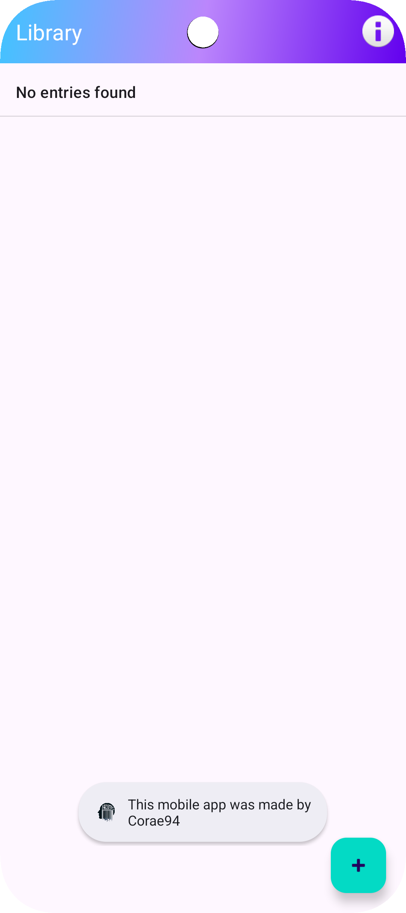
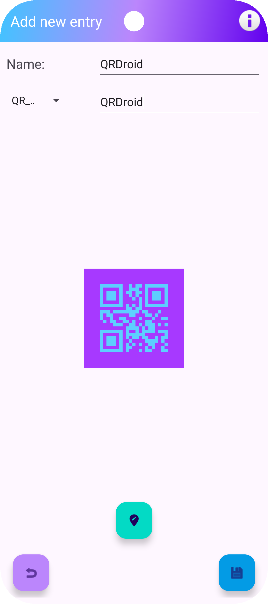
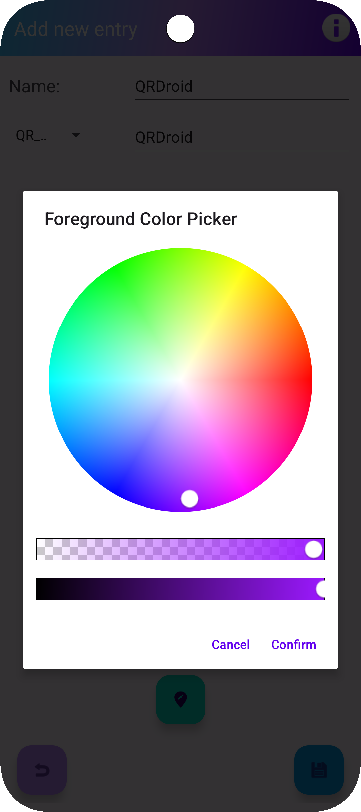
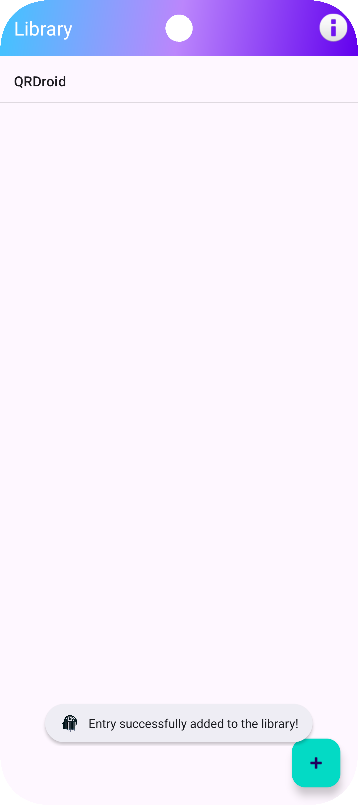
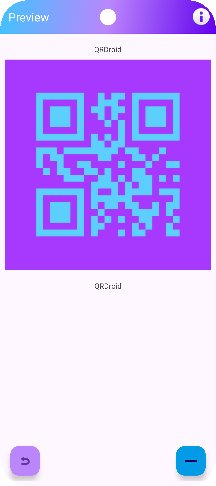
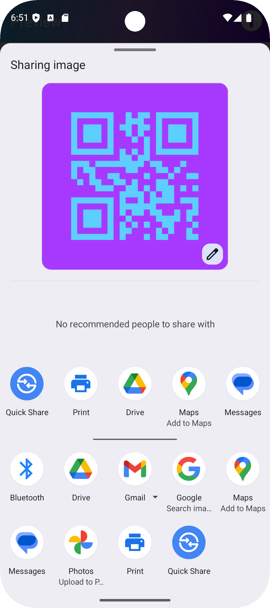

# qrdroid_release

public repo for the release of the qrdroid apk for android
a simple and fast app to generate and share bidimensional codes and enabling the user to pick the colors for the
two layers of the generated code. 
The codes can be shared through the internal android APIs as images
Homepage                             |Bidimensional codes creation page    |Color picker
------------------------------------:|------------------------------------:|-------------
 ||

List of created codes in homepage    |Preview page                            |Sharing function
------------------------------------:|---------------------------------------------:|-------------
||

## Credits
 The app logo has been generated by chatGPT

## Plans for future updates
 Implementation of embedded images inside the qr codes, more bidimensional codes to generate, even custom ones
